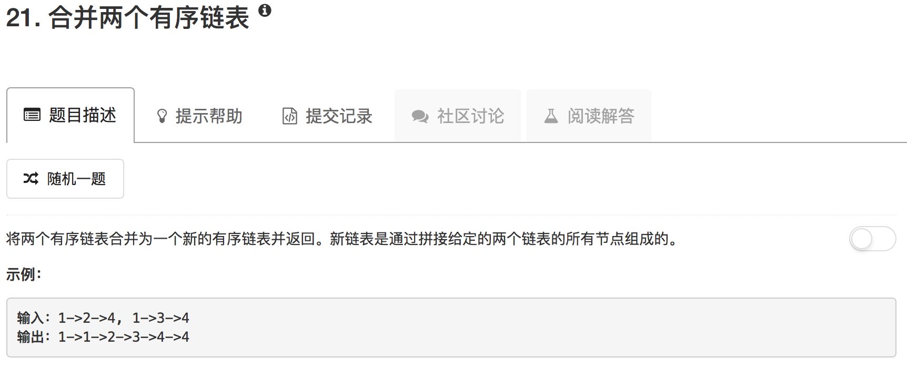

```python
# Definition for singly-linked list.
# class ListNode(object):
#     def __init__(self, x):
#         self.val = x
#         self.next = None

class Solution(object):
    def mergeTwoLists(self, l1, l2):
        """
        :type l1: ListNode
        :type l2: ListNode
        :rtype: ListNode
        """
        newlist = ListNode(-1)
        ans = newlist
        
        while l1 and l2:
            if l1.val < l2.val:
                newlist.next = l1
                l1 = l1.next
            else:
                newlist.next = l2
                l2 = l2.next
            newlist = newlist.next
                
        if not l1 and l2:
            newlist.next = l2
        elif l1 and not l2:
            newlist.next = l1
        else:
            newlist.next = None
        
        return ans.next
```

