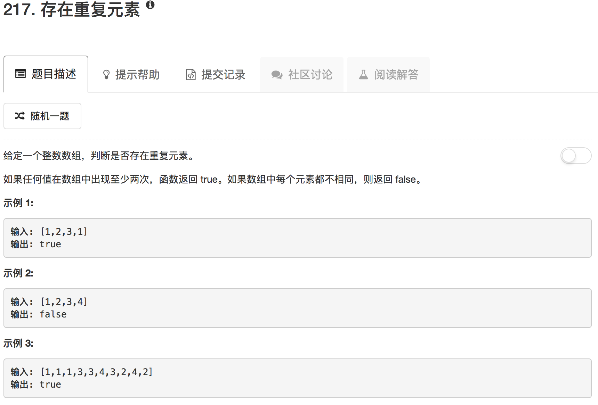

```python
class Solution(object):
    def containsDuplicate(self, nums):
        """
        :type nums: List[int]
        :rtype: bool
        """
        nums.sort()
        for idx in range(len(nums)-1):
            if nums[idx] == nums[idx+1]: 
                return True
        return False
```

