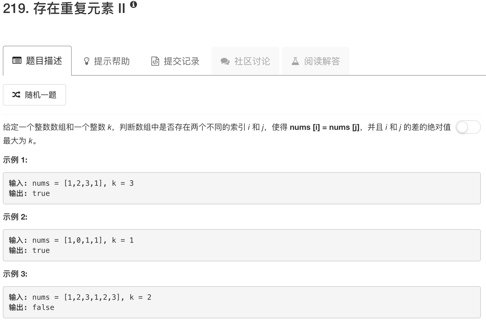

```python
class Solution(object):
    def containsNearbyDuplicate(self, nums, k):
        """
        :type nums: List[int]
        :type k: int
        :rtype: bool
        """
        table = {}
        for idx, num in enumerate(nums):
            if num in table:
                if abs(table[num] - idx) <= k: return True
                table[num] = idx
            else:
                table[num] = idx
        return False
```

