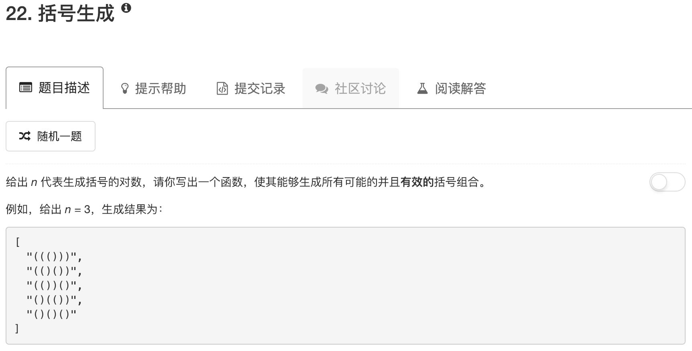

```python
class Solution:
    def DFS(self, left, right, tmp, ans):
        if left > right: return
        if left == 0 and right == 0: 
            ans.append(tmp)
        else:
            if left: self.DFS(left-1, right, tmp+"(", ans)
            if right: self.DFS(left, right-1, tmp+")", ans)
    
    def generateParenthesis(self, n):
        """
        :type n: int
        :rtype: List[str]
        """
        ans = []
        tmp = ""
        self.DFS(n,n,tmp,ans)
        return ans
```

这道题本质上还是DFS。考虑要列出全部结果，用递归比较方便。

这时候需要考虑边界情况。

由于一开始肯定要放一个左括号，所以当左括号数大于右括号数时，这种情况肯定是不合理的，直接返回

当左右括号数都用完了的时候，就把结果加入

其他情况就递归了，用掉哪个括号就加入哪个括号