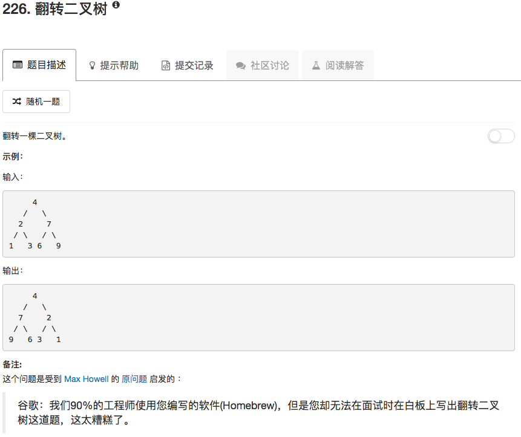

```python
# Definition for a binary tree node.
# class TreeNode(object):
#     def __init__(self, x):
#         self.val = x
#         self.left = None
#         self.right = None

class Solution(object):
    def invertTree(self, root):
        """
        :type root: TreeNode
        :rtype: TreeNode
        """
        if not root: return None
        if not root.left and not root.right: return root
        tmp = root.left
        root.left = root.right
        root.right = tmp
        root.left = self.invertTree(root.left)
        root.right = self.invertTree(root.right)
        return root
```

