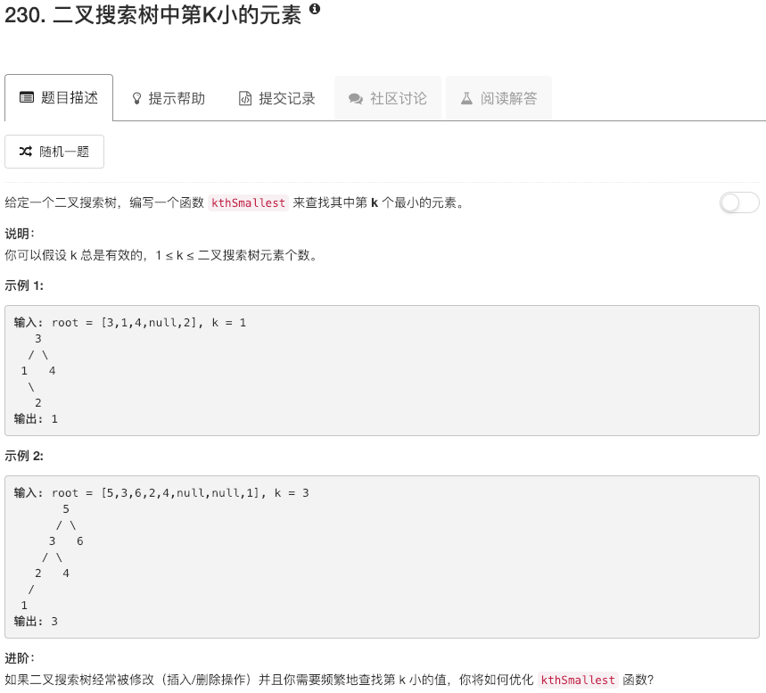

```python
# Definition for a binary tree node.
# class TreeNode:
#     def __init__(self, x):
#         self.val = x
#         self.left = None
#         self.right = None

class Solution:
    def traverse(self, root):
        if not root: return 
        
        ans = []
        left = self.traverse(root.left)
        right = self.traverse(root.right)
        
        if left: ans.extend(left)
        ans.append(root.val)
        if right: ans.extend(right)
        
        return ans
            
    
    def kthSmallest(self, root, k):
        """
        :type root: TreeNode
        :type k: int
        :rtype: int
        """
        search = self.traverse(root)
        idx = search.index(root.val)
        if idx + 1 == k:
            return root.val
        elif idx + 1 < k:
            tmp = search[idx:]
            tmp.sort()
            return tmp[k-idx-1]
        else:
            tmp = search[:idx]
            tmp.sort()
            return tmp[k-1]
```

