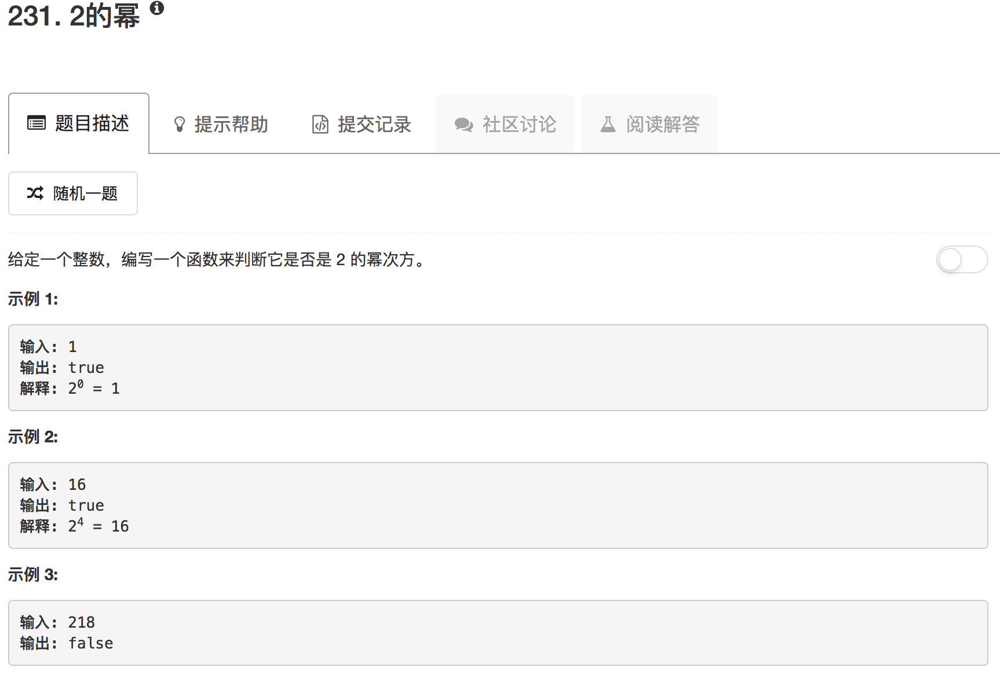

这题考察的是一个小技巧。2的幂次在二进制下，一定是1000...000，减一后变成1111....111，这样按位与后一定是0；如果不是2的幂次，一定最后是1。

```python
class Solution(object):
    def isPowerOfTwo(self, n):
        """
        :type n: int
        :rtype: bool
        """
        return n > 0 and not (n & n-1)
```

