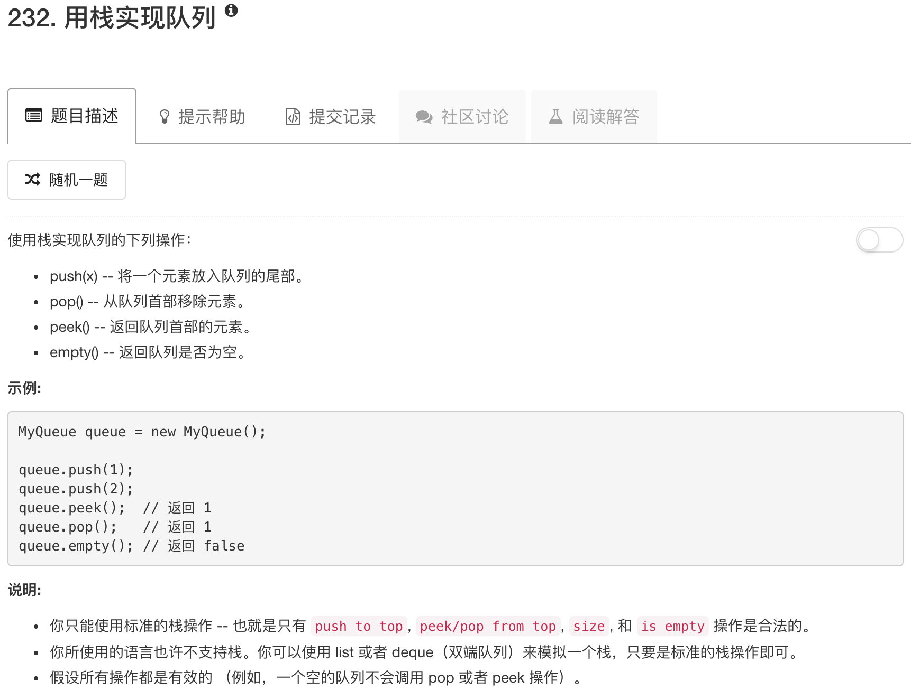

```python
class MyQueue(object):

    def __init__(self):
        """
        Initialize your data structure here.
        """
        self.array = []
        

    def push(self, x):
        """
        Push element x to the back of queue.
        :type x: int
        :rtype: void
        """
        self.array.append(x)
        

    def pop(self):
        """
        Removes the element from in front of queue and returns that element.
        :rtype: int
        """
        element = self.array[0]
        del self.array[0]
        return element
        

    def peek(self):
        """
        Get the front element.
        :rtype: int
        """
        return self.array[0]
        

    def empty(self):
        """
        Returns whether the queue is empty.
        :rtype: bool
        """
        return True if len(self.array) == 0 else False
        


# Your MyQueue object will be instantiated and called as such:
# obj = MyQueue()
# obj.push(x)
# param_2 = obj.pop()
# param_3 = obj.peek()
# param_4 = obj.empty()
```

