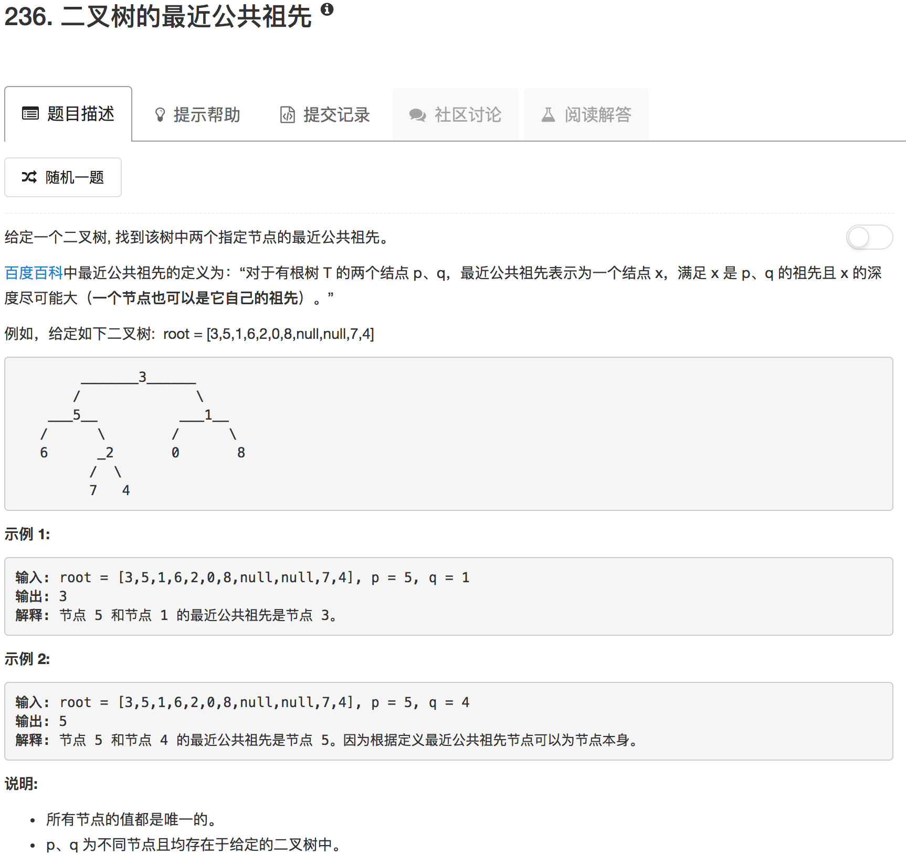

```python
# Definition for a binary tree node.
# class TreeNode(object):
#     def __init__(self, x):
#         self.val = x
#         self.left = None
#         self.right = None

class Solution(object):
    def lowestCommonAncestor(self, root, p, q):
        """
        :type root: TreeNode
        :type p: TreeNode
        :type q: TreeNode
        :rtype: TreeNode
        """
        if not root or root.val == p.val or root.val == q.val: return root
        
        left = None if not root.left else self.lowestCommonAncestor(root.left, p, q)
        right = None if not root.right else self.lowestCommonAncestor(root.right, p, q)
        
        if left and right:
            return root
        elif left and not right:
            return left
        else:
            return right
```

