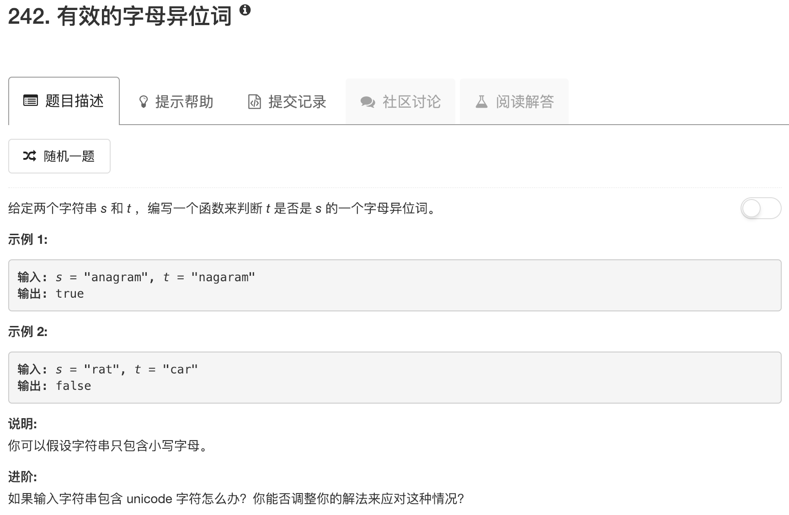

```python
class Solution:
    def isAnagram(self, s, t):
        """
        :type s: str
        :type t: str
        :rtype: bool
        """
        if len(s) != len(t): return False
        
        table = {}
        for char in set(s):
            table[char] = 0
            
        for ii in range(len(s)):
            if s[ii] in table: table[s[ii]] += 1
            if t[ii] in table: 
                table[t[ii]] -= 1
            else:
                return False
        
        for item in table:
            if table[item] != 0: return False
        return True
```

