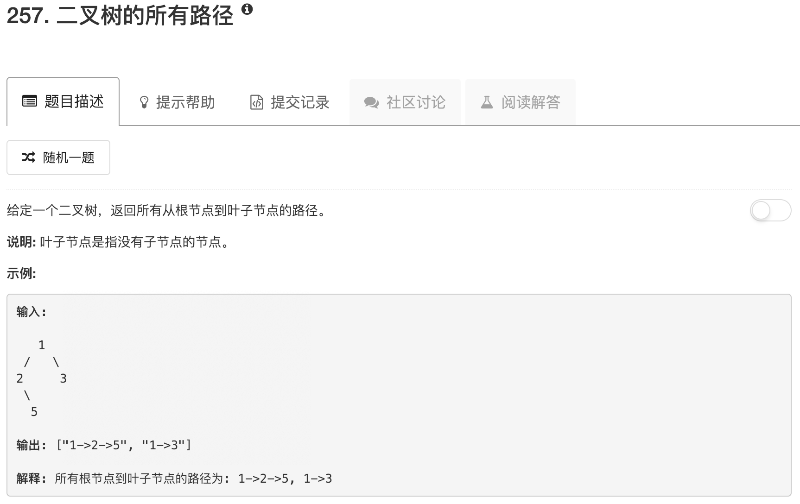

```python
# Definition for a binary tree node.
# class TreeNode:
#     def __init__(self, x):
#         self.val = x
#         self.left = None
#         self.right = None

class Solution:
    def walk(self, root, path, ans):
        if not root.left and not root.right:
            ans.append(path+str(root.val))
            return
        if root.left:
            self.walk(root.left,path+str(root.val)+"->",ans)
        if root.right:
            self.walk(root.right,path+str(root.val)+"->",ans)
    
    def binaryTreePaths(self, root):
        """
        :type root: TreeNode
        :rtype: List[str]
        """
        if not root: return []
        ans = []
        path = ""
        
        self.walk(root,path,ans)
            
        return ans
```

