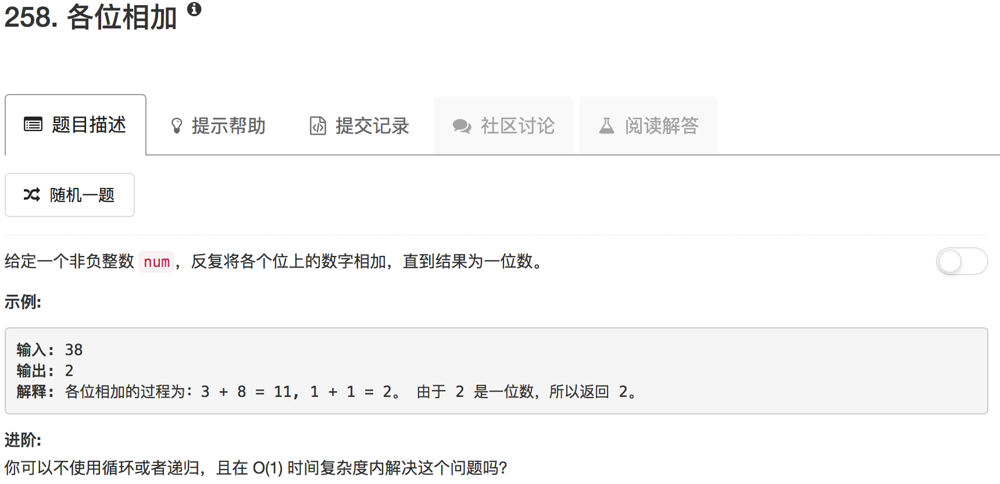

这道题用循环或者递归的话不难，但是要在常数时间复杂度内解决就有点麻烦了。

不过这里还是有规律的：

10 = 1+0 = 1

11 = 1+1 = 2

12 = 1+2 = 3

。。。

19 = 1+9 = 10 = 1

。。。

其实这里是个循环。大于9的任何数，每位相加最后得到的数就是原来的数字对9取余

```python
class Solution(object):
    def addDigits(self, num):
        """
        :type num: int
        :rtype: int
        """
        if num == 0:
            return 0
        elif num % 9 != 0:
            return num % 9
        else:
            return 9
```

```python
class Solution(object):
    def addDigits(self, num):
        """
        :type num: int
        :rtype: int
        """
        while num > 9:
            tmp = 0
            number = num
            while number:
                tmp = tmp + number % 10
                number = number // 10
            num = tmp
        return num
```

