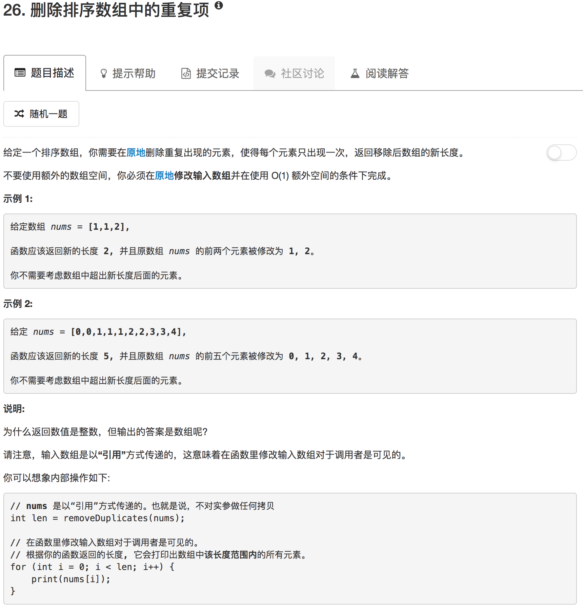

```python
class Solution(object):
    def removeDuplicates(self, nums):
        """
        :type nums: List[int]
        :rtype: int
        """
        if len(nums) == 1: return 1
        for ii in range(len(nums)-1,0,-1):
            if nums[ii] == nums[ii-1]:
                del nums[ii]
        return len(nums) 
```

