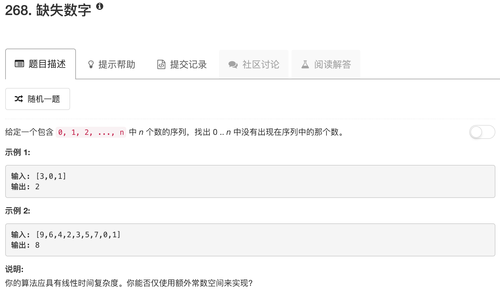

```python
class Solution:
    def missingNumber(self, nums):
        """
        :type nums: List[int]
        :rtype: int
        """
        return len(nums)*(len(nums)+1)//2 - sum(nums)
```

这道题。。。确定不是考察的等差数列？