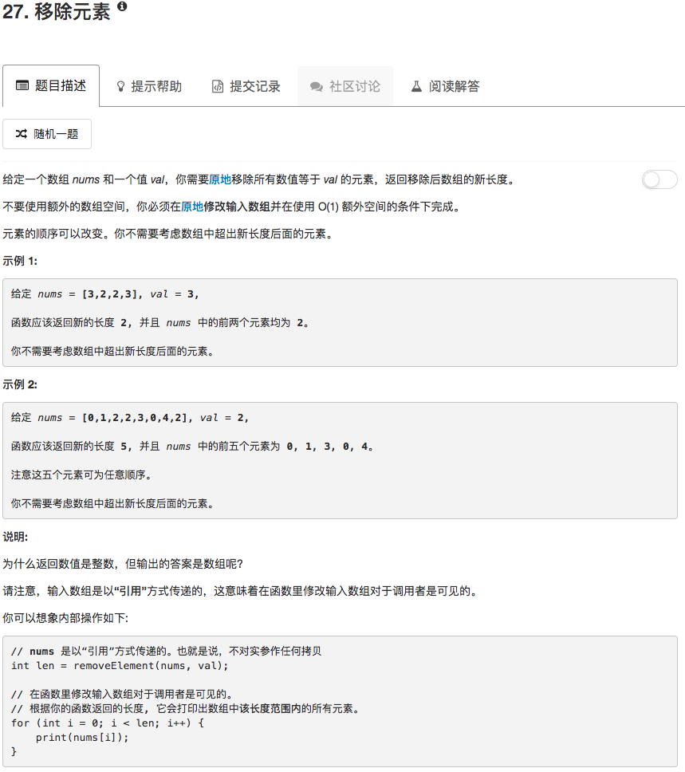

```python
class Solution(object):
    def removeElement(self, nums, val):
        """
        :type nums: List[int]
        :type val: int
        :rtype: int
        """
        length = len(nums)
        for ii in range(length):
            if nums[length-ii-1] == val:
                del nums[length-ii-1]
        return len(nums)
```

