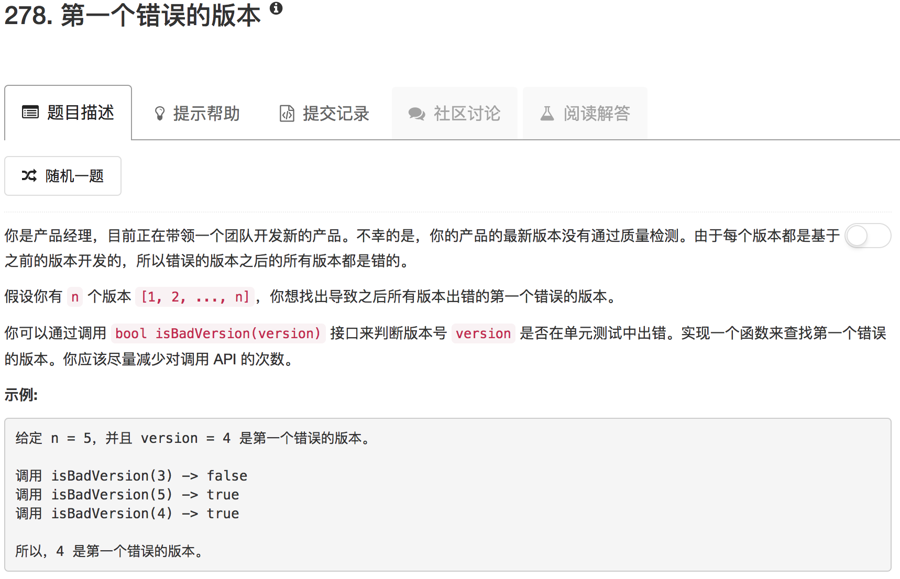

```python
# The isBadVersion API is already defined for you.
# @param version, an integer
# @return a bool
# def isBadVersion(version):

class Solution(object):
    def search(self, low, high):
        if low == high: return low
        if high == low+1 and not isBadVersion(low) and isBadVersion(high): return high
        mid = (low+high) // 2
        if isBadVersion(mid):
            return self.search(low, mid)
        else:
            return self.search(mid,high)
        
    def firstBadVersion(self, n):
        """
        :type n: int
        :rtype: int
        """
        if n == 1: return 1
        return self.search(1,n)
```

