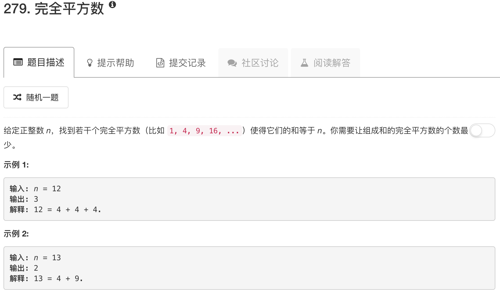

这道题是出现在“队列和栈”的卡片中的，属于广度优先搜索的范畴，所以这里用BFS来解决。其实最优关于“最小”，“最近”之类的题都可以尝试用BFS解决。在这道题里，相邻节点本质就是减去的数。具体来说，假设现在要求的n=12，我们记录步数，因此，最开始的队列里就有[12,0]，然后我们知道，12以内只有1，4，9三个完全平方数，因此，相邻节点就是：[11,1]，[8,1]，[3,1]，然后依次BFS即可

```python
import numpy as np
class Solution(object):
    def numSquares(self, n):
        """
        :type n: int
        :rtype: int
        """
        queue = [[n, 0]]
        visited = set()
        
        while queue:
            num, step = queue.pop(0)
            
            for ii in range(1, int(np.sqrt(num))+1):
                if ii*ii == num: return step + 1
                
                res = num - ii* ii
                if not res in visited:
                    visited.add(res)
                    queue.append([res, step+1])
```

