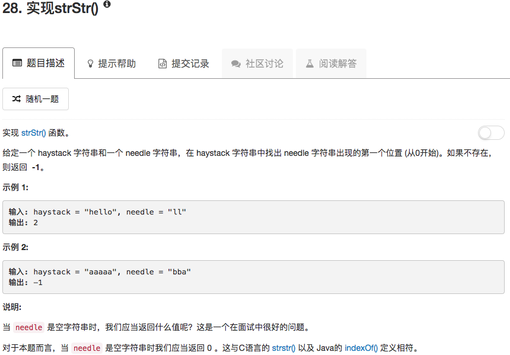

```python
class Solution(object):
    def strStr(self, haystack, needle):
        """
        :type haystack: str
        :type needle: str
        :rtype: int
        """
        if len(haystack) < len(needle): return -1
        if haystack == needle: return 0
        
        for ii in range(len(haystack)-len(needle)+1):
            if haystack[ii:ii+len(needle)] == needle:
                return ii
        return -1
```

