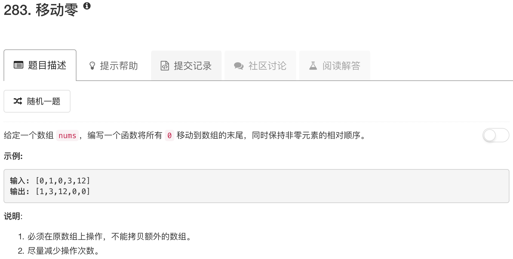

```python
class Solution(object):
    def moveZeroes(self, nums):
        """
        :type nums: List[int]
        :rtype: void Do not return anything, modify nums in-place instead.
        """
        length = len(nums)
        for ii in range(length):
            if nums[length-ii-1] == 0:
                nums.append(0)
                del nums[length-ii-1]
```

