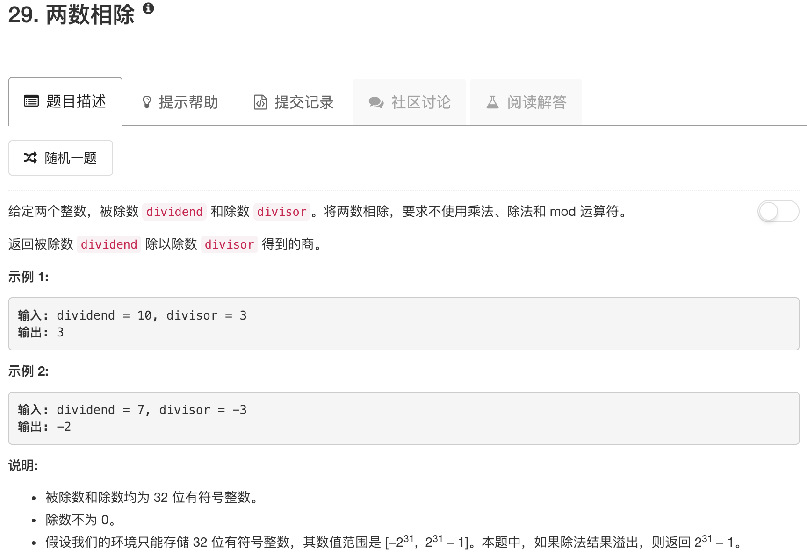

```python
class Solution:
    def divide(self, dividend, divisor):
        """
        :type dividend: int
        :type divisor: int
        :rtype: int
        """
        flag = False
        if dividend < 0 and divisor > 0:
            dividend = -dividend
            flag = True
        if dividend > 0 and divisor < 0:
            divisor = -divisor
            flag = True
        if dividend < 0 and divisor < 0:
            dividend = -dividend
            divisor = -divisor 
        ans = 0
        while dividend >= divisor:
            tmp = divisor
            count = 1
            while dividend >= (tmp<<1):
                tmp = tmp << 1
                count = count*2
            dividend = dividend - tmp
            ans = ans + count
        if flag: ans = -ans
        if ans > 2147483647 or ans < -2147483648: return 2147483647
        return ans
```

