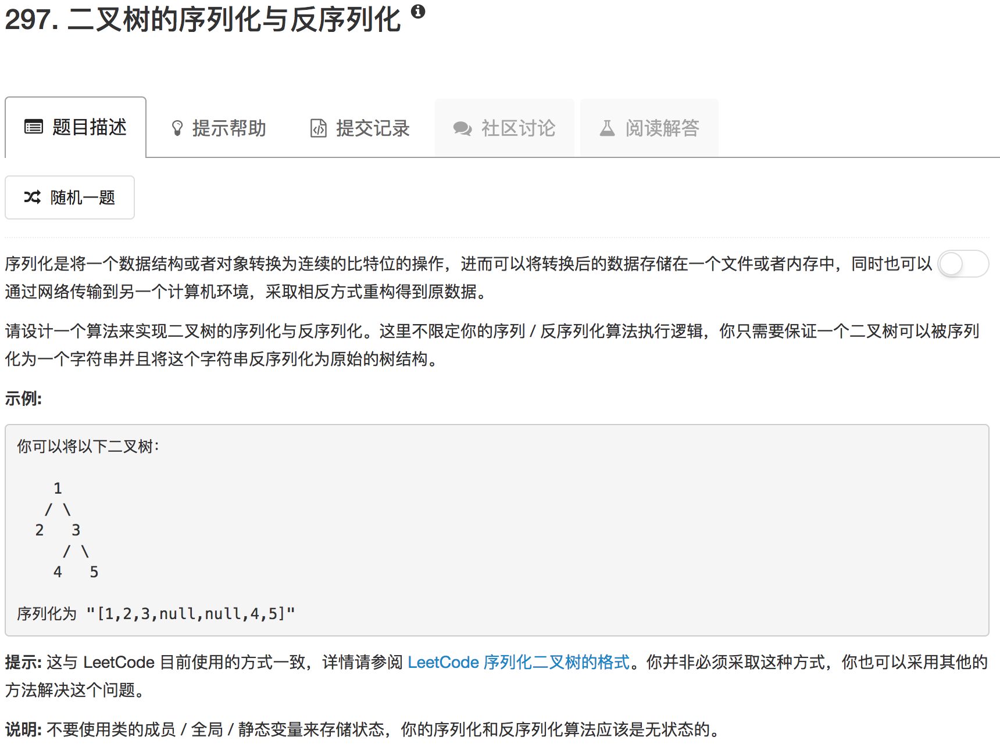

```python
# Definition for a binary tree node.
# class TreeNode(object):
#     def __init__(self, x):
#         self.val = x
#         self.left = None
#         self.right = None

class Codec:
    
    def serialize(self, root):
        """Encodes a tree to a single string.
        
        :type root: TreeNode
        :rtype: str
        """
        if not root: return '#'
        return str(root.val) + ' ' + self.serialize(root.left) + ' ' + self.serialize(root.right)
    
    def buildTree(self, dataList):
        root = None
        if dataList:
            val = dataList.pop(0)
            if val != '#':
                root = TreeNode(int(val))
                root.left = self.buildTree(dataList)
                root.right = self.buildTree(dataList)
        return root
            
    def deserialize(self, data):
        """Decodes your encoded data to tree.
        
        :type data: str
        :rtype: TreeNode
        """
        dataList = data.split()
        return self.buildTree(dataList)
        
        
# Your Codec object will be instantiated and called as such:
# codec = Codec()
# codec.deserialize(codec.serialize(root))
```

