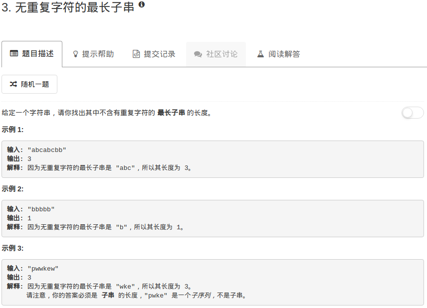

```python
class Solution:
    def lengthOfLongestSubstring(self, s):
        """
        :type s: str
        :rtype: int
        """
        searchTable = dict()
        ans = 0
        left = 0
        for ii in range(len(s)):
            left = max(left, searchTable.get(s[ii],0))
            searchTable[s[ii]] = ii+1
            ans = max(ans, ii-left+1)
        return ans
```

这里有个细节要注意，就是这两句：

```python
searchTable[s[ii]] = ii+1
ans = max(ans, ii-left+1)
```

其实一开始我是写成：

```python
searchTable[s[ii]] = ii
ans = max(ans, ii-left+1)
```

但这是不对的。因为滑动窗口需要保证的是窗口内没有重复的字符，所以应该指向字符的下一个位置，具体而言，比如a的位置是3，如果有下一个a出现，那么left指针应该指向的是4这个位置，而不是3。这样写的另一个好处就是针对“ ”这种字符串能够正确计算。