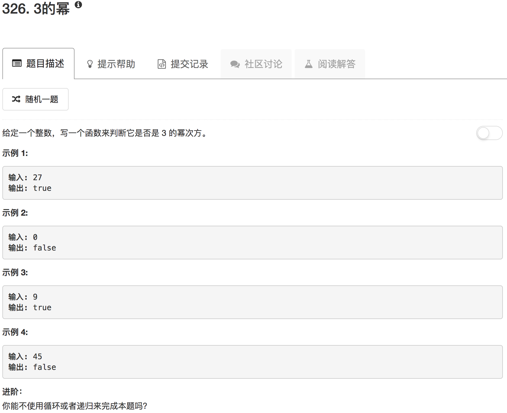

```python
class Solution(object):
    def isPowerOfThree(self, n):
        """
        :type n: int
        :rtype: bool
        """
        if n == 0: return False
        if n == 1: return True
        if n < 0: return False
        start = 1
        while True:
            start = start * 3
            if start == n:
                return True
            elif start > n:
                return False
```

