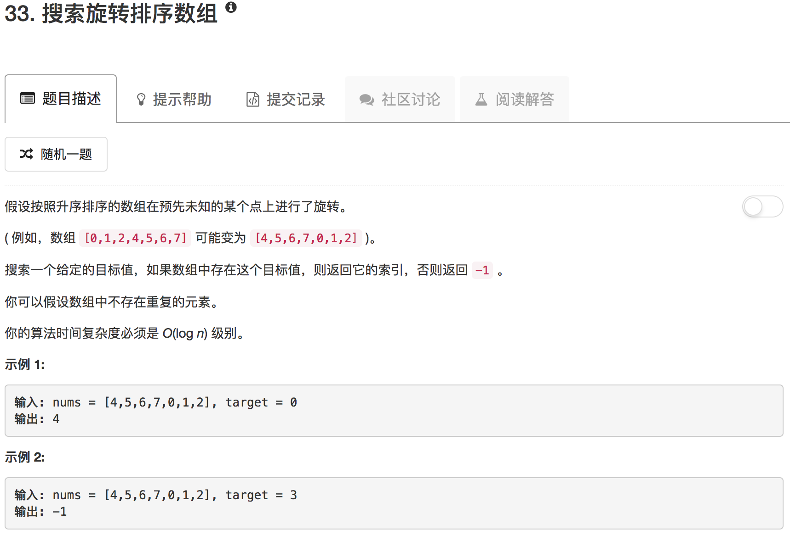

```python
class Solution(object):
    def binarySearch(self, nums, low, high, target):
        if low == high: return low if nums[low] == target else -1
        mid = (low + high) // 2
        if nums[mid] == target:
            return mid
        elif nums[mid] > target:
            return self.binarySearch(nums, low, mid, target)
        else:
            return self.binarySearch(nums, mid+1, high, target)
    
    def search(self, nums, target):
        """
        :type nums: List[int]
        :type target: int
        :rtype: int
        """
        if not nums: return -1
        if len(nums) == 1: return 0 if nums[0] == target else -1
        mid = (len(nums)-1) // 2
        if nums[mid] == target: return mid
        if nums[0] == target: return 0
        if nums[-1] == target: return len(nums)-1
        print mid, nums
        if nums[mid] >= nums[0] and nums[mid] > nums[len(nums)-1]:
            if nums[mid] > target and target > nums[0]:
                return self.binarySearch(nums, 0, mid, target)
            else:
                idx = self.search(nums[mid+1:], target)
                if idx == -1: 
                    return -1
                else:
                    return mid+idx+1
        elif nums[mid] <= nums[0] and nums[mid] <= nums[len(nums)-1]:
            if nums[mid] < target and target < nums[len(nums)-1]:
                return self.binarySearch(nums, mid, len(nums)-1, target)
            else:
                idx = self.search(nums[:mid], target)
                if idx == -1:
                    return -1
                else:
                    return idx
        else:
            return self.binarySearch(nums, 0, len(nums)-1, target)
```

