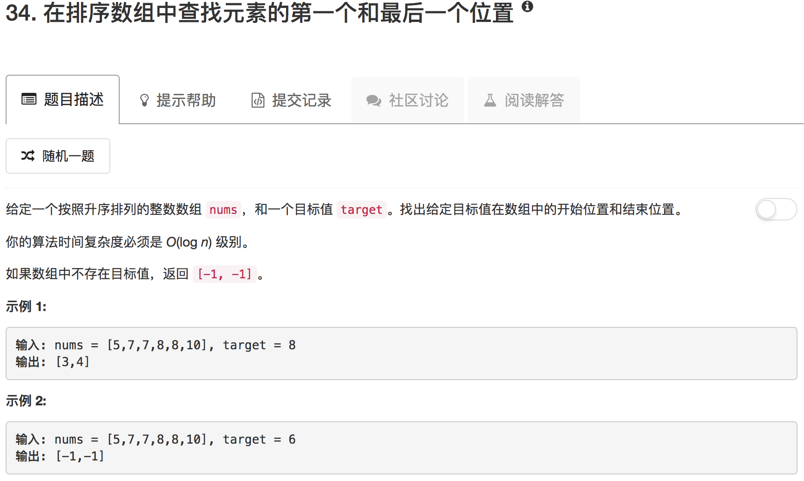

```python
class Solution(object):
    def searchRange(self, nums, target):
        """
        :type nums: List[int]
        :type target: int
        :rtype: List[int]
        """
        if not nums: return [-1,-1] 
        if len(nums) == 1: return [0 ,0] if nums[0] == target else [-1, -1]
        
        ans = []
        
        left, right = 0, len(nums)-1
        
        idx = -1
        
        while left < right:
            mid = (left+right) // 2
            if nums[mid] == target:
                idx = mid
                break
            elif nums[mid] < target:
                left = mid+1
            else:
                right = mid-1
                
        if left == right and nums[left] == target: idx = left
        
        if idx == -1: return [-1,-1]
        
        left, right = idx, idx
        while left >= 0 and nums[left] == target: 
            left = left - 1
        while right < len(nums) and nums[right] == target:
            right = right + 1
        
        return [left+1, right-1]
```

