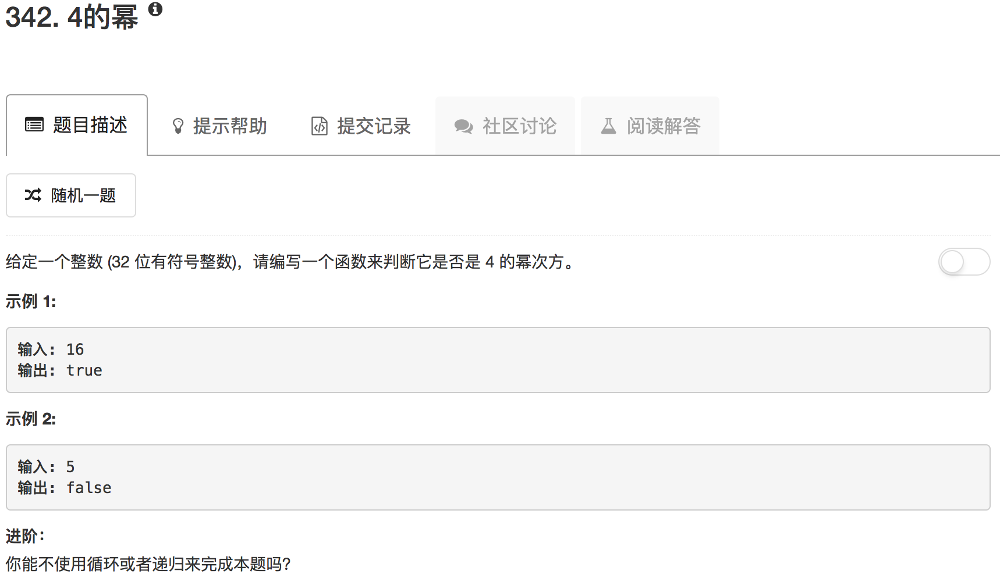

```python
class Solution(object):
    def isPowerOfFour(self, num):
        """
        :type num: int
        :rtype: bool
        """
        if num == 0: return False
        if num == 1: return True
        if num < 0: return False
        start = 1
        while True:
            start = start * 4
            if start == num:
                return True
            elif start > num:
                return False
```

