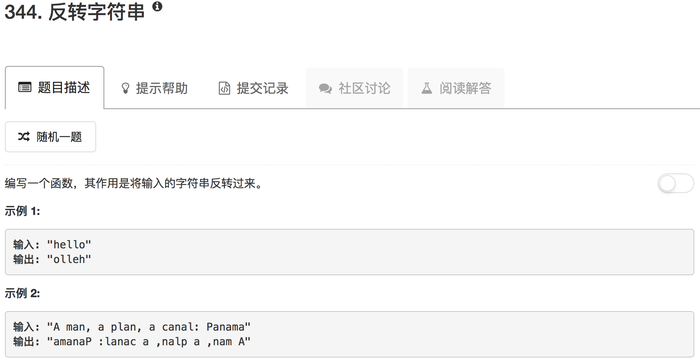

```python
class Solution(object):
    def reverseString(self, s):
        """
        :type s: str
        :rtype: str
        """
        ans = []
        for ii in range(len(s)):
            ans.append(s[len(s)-ii-1])
        return ''.join(ans)
```

