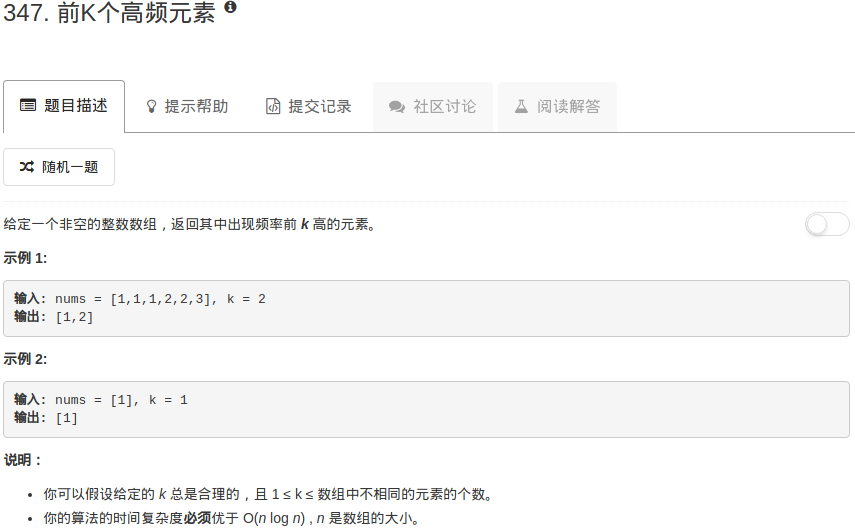

```python
class Solution:
    def topKFrequent(self, nums, k):
        """
        :type nums: List[int]
        :type k: int
        :rtype: List[int]
        """
        searchTable = dict()
        numset = set(nums)
        for num in nums:
            searchTable[num] = searchTable[num] + 1 if num in searchTable else 1
        all = sorted(searchTable.items(), key=lambda s: s[1], reverse=True)
        return [all[i][0] for i in range(k)]  
```

这里主要是要用到sorted函数和python中字典的iterms方法。

sorted函数对所有可迭代对象进行排序，iterms方法则是返回字典的键值对

