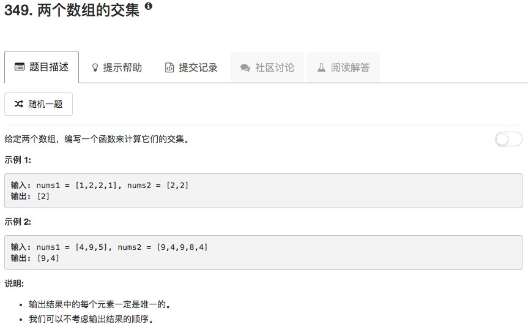

```python
class Solution(object):
    def intersection(self, nums1, nums2):
        """
        :type nums1: List[int]
        :type nums2: List[int]
        :rtype: List[int]
        """
        setShort, mynums = [set(nums1), nums2] if len(nums1) < len(nums2) else [set(nums2), nums1]
        ans = []
        for num in setShort:
            if num in mynums:
                ans.append(num)
        return ans
```

