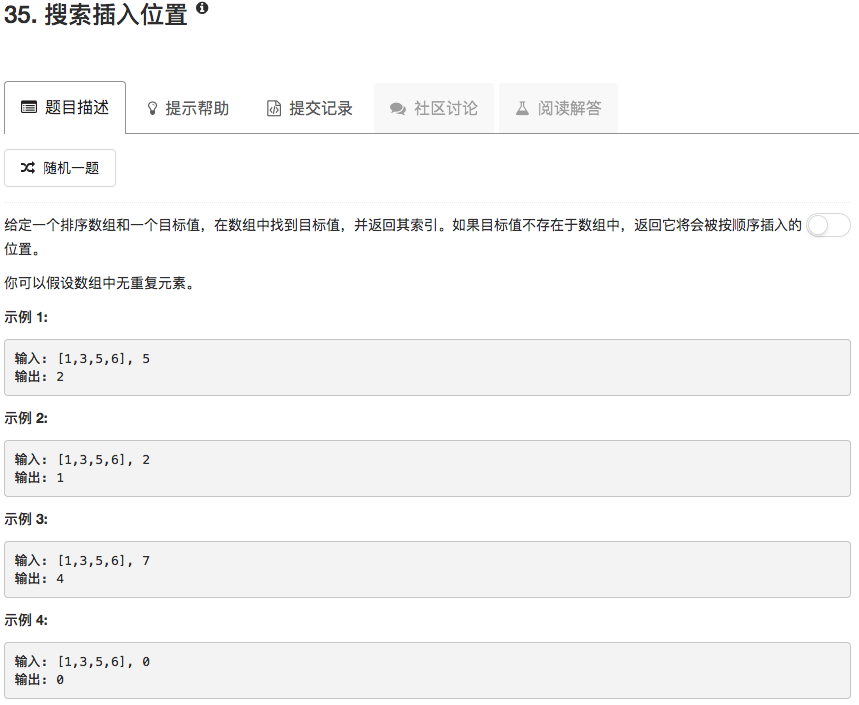

```python
class Solution(object):
    def searchInsert(self, nums, target):
        """
        :type nums: List[int]
        :type target: int
        :rtype: int
        """
        for ii in range(len(nums)):
            if nums[ii] == target:
                return ii
            elif nums[ii] > target:
                nums.insert(ii, target)
                return ii
        nums.append(target)
        return len(nums)-1
```

