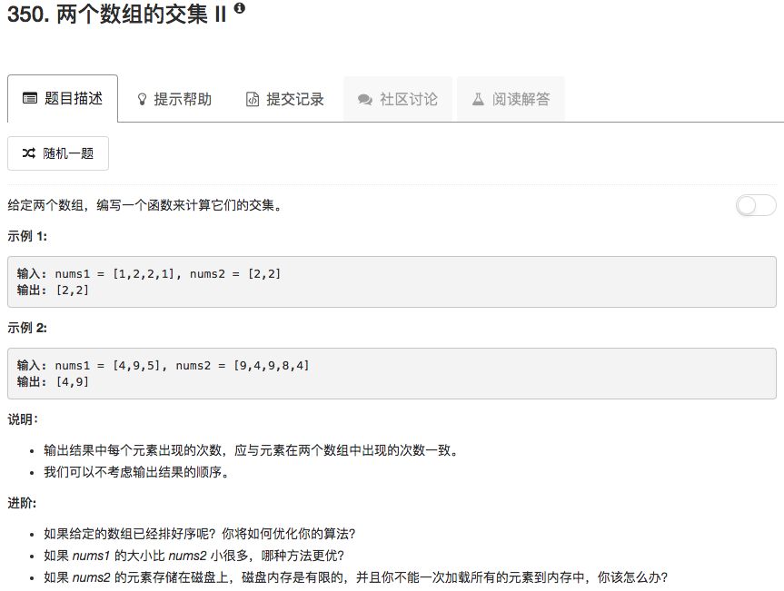

```python
class Solution(object):
    def intersect(self, nums1, nums2):
        """
        :type nums1: List[int]
        :type nums2: List[int]
        :rtype: List[int]
        """
        longer, shorter, longnums, shortnums = [len(nums1), len(nums2), nums1, nums2] if len(nums1) > len(nums2) else [len(nums2), len(nums1), nums2, nums1]
        lonTable = {}
        shortTable = {}
        
        for ii in range(longer):
            if longnums[ii] in lonTable.keys(): 
                lonTable[longnums[ii]] = lonTable[longnums[ii]] + 1
            else:
                lonTable[longnums[ii]] = 1
            
            if ii < shorter:
                if shortnums[ii] in shortTable.keys():
                    shortTable[shortnums[ii]] = shortTable[shortnums[ii]] + 1
                else:
                    shortTable[shortnums[ii]] = 1
        
        ans = []

        for num in shortTable.keys():
            if num in lonTable.keys():
                nn = lonTable[num]
                if nn < shortTable[num]:
                    ans.extend([num] * nn)
                else:
                    ans.extend([num] * shortTable[num])
        return ans
```

