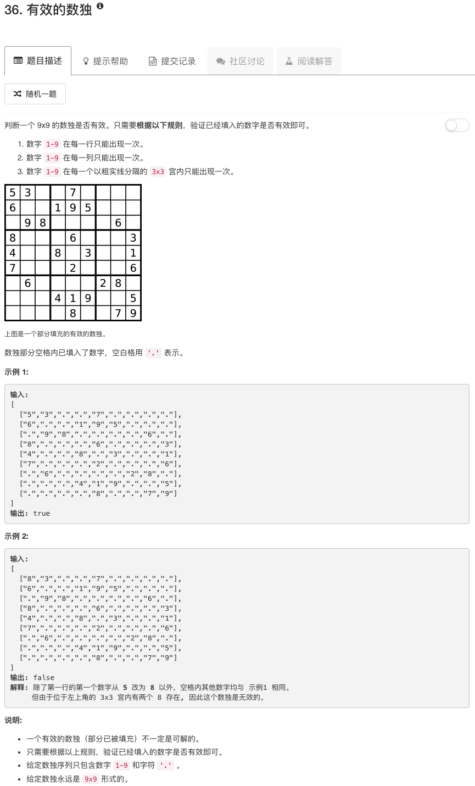

```python
class Solution(object):
    def checkRow(self, board):
        flag = True
        for row in board:
            table = set()
            for each in row:
                if each != "." and each in table:
                    flag = False
                else:
                    table.add(each)
        return flag
    
    def checkCol(self, board):
        flag = True
        nrow = len(board)
        ncol = len(board[0])
        for idy in range(ncol):
            table = set()
            for idx in range(nrow):
                each = board[idx][idy]
                if each != "." and each in table:
                    flag = False
                else:
                    table.add(each)
        return flag
    
    def checkSub(self, board):
        flag = True
        nrow = len(board)
        ncol = len(board[0])
        nsubrow = nrow // 3
        nsubcol = ncol // 3
        for ii in range(nsubrow):
            for jj in range(nsubcol):
                sub = [board[ii*3][jj*3:jj*3+3]]
                sub.append(board[ii*3+1][jj*3:jj*3+3])
                sub.append(board[ii*3+2][jj*3:jj*3+3])
                table = set()
                for subrow in sub:
                    for each in subrow:
                        if each != "." and each in table:
                            flag = False
                        else:
                            table.add(each)
        return flag
    
    def isValidSudoku(self, board):
        """
        :type board: List[List[str]]
        :rtype: bool
        """
        return self.checkRow(board) and self.checkCol(board) and self.checkSub(board)
```

