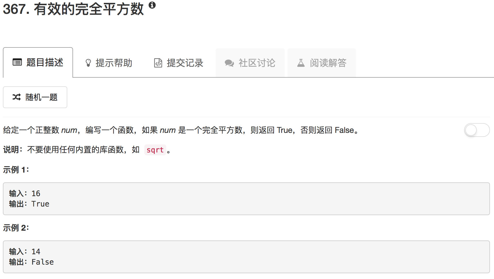

```python
class Solution(object):
    def isPerfectSquare(self, num):
        """
        :type num: int
        :rtype: bool
        """
        if num == 1: return True
        
        low = 1
        high = num // 2
        
        while low < high-1:
            mid = (low+high)//2
            if mid**2 == num: 
                return True
            elif mid**2 > num:
                high = mid
            else:
                low = mid
        if low**2 == num: return True
        if high**2 == num: return True
        return False
```

