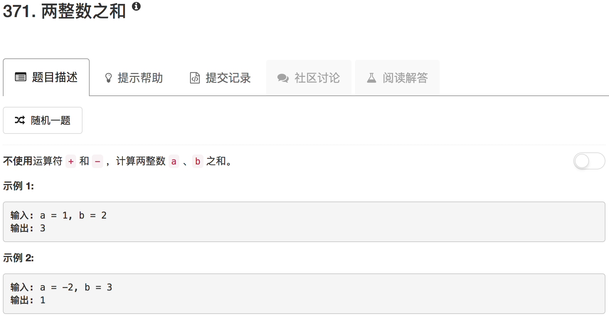

这道题本意考察的是位运算。a&b代表哪些位相加后需要进位，然后将这个结果左移一位得到需要进位的部分。a^b代表每一位相加的最后结果。然后递归调用getSum就行了

```python
class Solution(object):
    def getSum(self, a, b):
        """
        :type a: int
        :type b: int
        :rtype: int
        """
        return sum([a,b])
```

