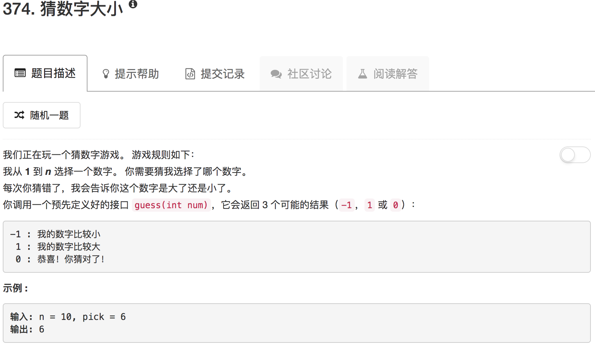

```python
# The guess API is already defined for you.
# @param num, your guess
# @return -1 if my number is lower, 1 if my number is higher, otherwise return 0
# def guess(num):

class Solution(object):
    def myguess(self, curr, max):
        resp = guess(curr)
        print curr
        if resp == 0: return curr
        if resp == 1: return self.myguess((curr+max+1)//2,max)
        if resp == -1: return self.myguess((curr)//2,curr)
          
    def guessNumber(self, n):
        """
        :type n: int
        :rtype: int
        """
        return self.myguess(n, n)
```

