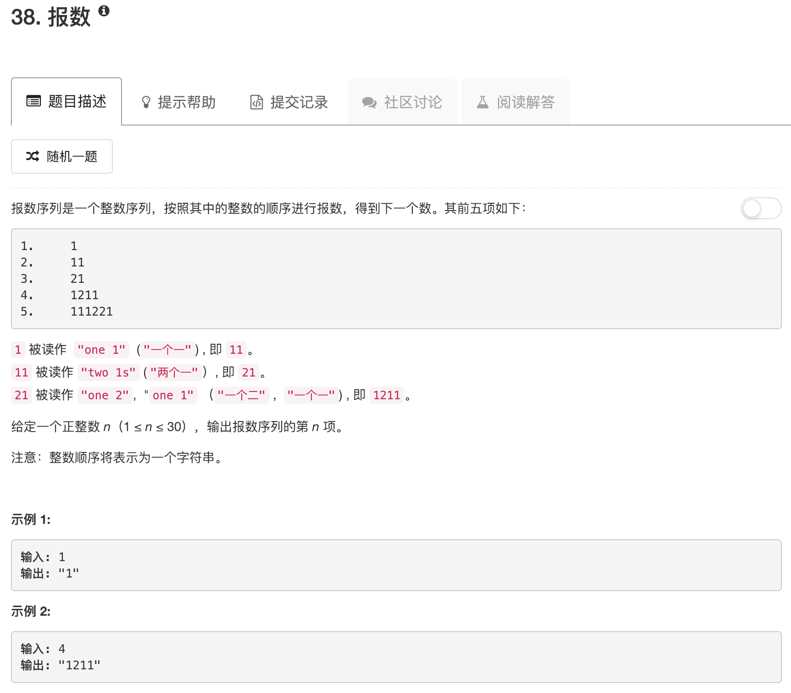

```python
class Solution:  
    def countAndSay(self, n):  
        """ 
        :type n: int 
        :rtype: str 
        """  
        if n==1:#类似于斐波拉契数，后面的数跟前面的数有关  
            return '1'  
        if n==2:  
            return '11'
        #进行i=3时的循环时，它的上一项为'11'
        pre='11'
        
        #用for循环不断去计算逼近最后一次
        for i in range(3,n+1):  
            res=''#结果，每次报数都要初始化  
            cnt=1#计数变量
            
            length=len(pre)#遍历我们的上一项，所以记录它的长度
            for j in range(1,length):  
                if pre[j-1]==pre[j]:#相等则加一  
                    cnt+=1  
                else:
                    #一旦遇到不同的变量，就更新结果
                    res+=str(cnt)+pre[j-1]  
                    cnt=1#重置为1
            #把最后一项及它的数量加上
            res+=str(cnt)+pre[j]  
            pre=res#保存上一次的结果  
        return res
```

