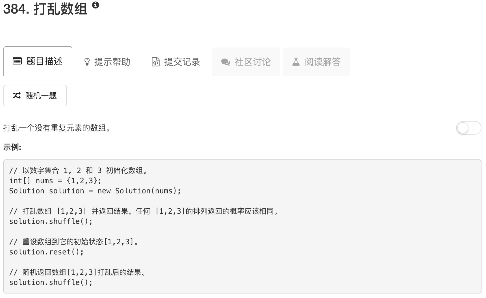

```python
import random
import copy
class Solution:

    def __init__(self, nums):
        """
        :type nums: List[int]
        """
        self.nums = nums
        self.table = {}
        for ii in range(len(nums)):
            self.table[nums[ii]] = ii

    def reset(self):
        """
        Resets the array to its original configuration and return it.
        :rtype: List[int]
        """
        ans = copy.deepcopy(self.nums)
        for num in self.nums:
            idx = self.table[num]
            ans[idx] = num
        return ans
        

    def shuffle(self):
        """
        Returns a random shuffling of the array.
        :rtype: List[int]
        """
        random.shuffle(self.nums)
        return self.nums


# Your Solution object will be instantiated and called as such:
# obj = Solution(nums)
# param_1 = obj.reset()
# param_2 = obj.shuffle()
```

