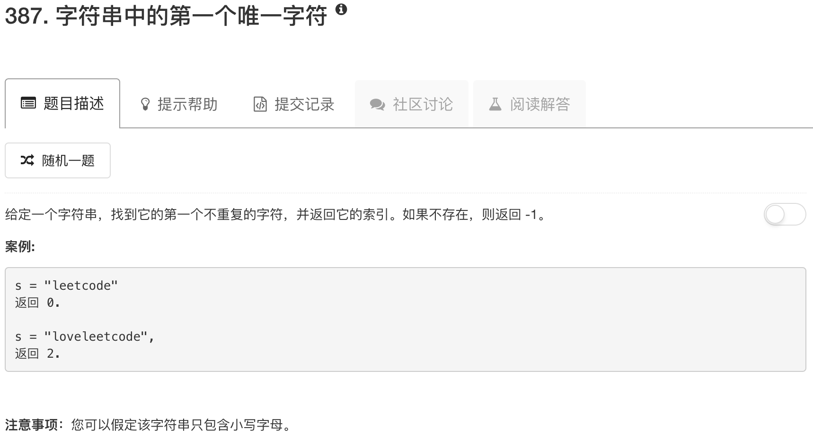

```python
class Solution(object):
    def firstUniqChar(self, s):
        """
        :type s: str
        :rtype: int
        """
        table = {}
        for char in s:
            if char in table: 
                table[char] = table[char] + 1
            else:
                table[char] = 1
        
        idx = len(s)
        for char in table.keys():
            if table[char] == 1:
                if s.index(char) < idx:
                    idx = s.index(char)
        
        if idx == len(s):
            return -1
        else:
            return idx
```

