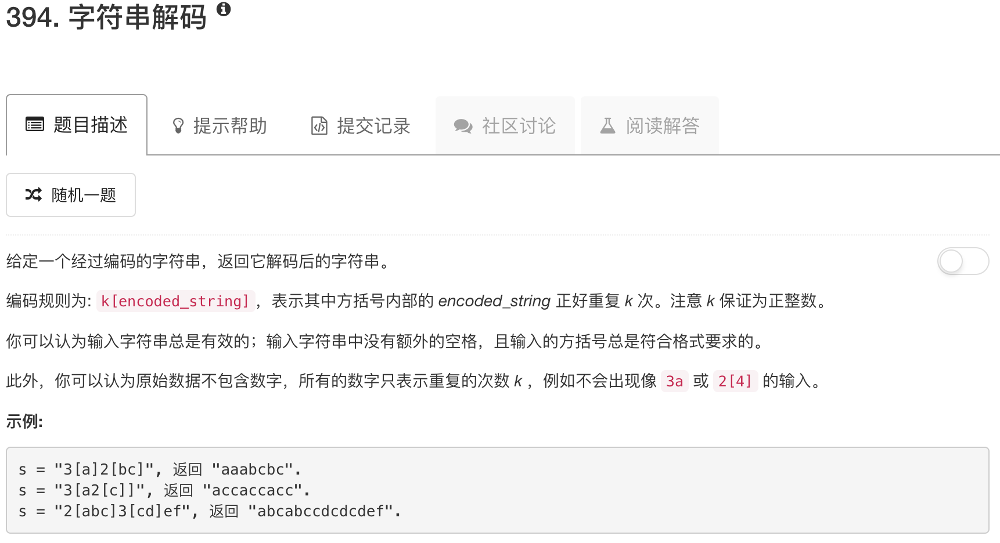

```python
class Solution(object):
    def decodeString(self, s):
        """
        :type s: str
        :rtype: str
        """ 
        charStack = []
        for char in s:
            if char != "]":
                charStack.append(char)
            else:
                substr = ""
                while True:
                    element = charStack.pop()
                    if element == "[":
                        times = ""
                        while True:
                            if len(charStack) != 0:
                                num = charStack.pop()
                                print num
                                if num not in ["1","2","3","4","5","6","7","8","9","0"]:
                                    charStack.append(num)
                                    break
                                else:
                                    times = num + times
                            else:
                                break
                        substr = substr * int(times)
                        break
                    else:
                        substr = element + substr
                charStack.append(substr)
            print charStack
        return "".join(charStack)
```

