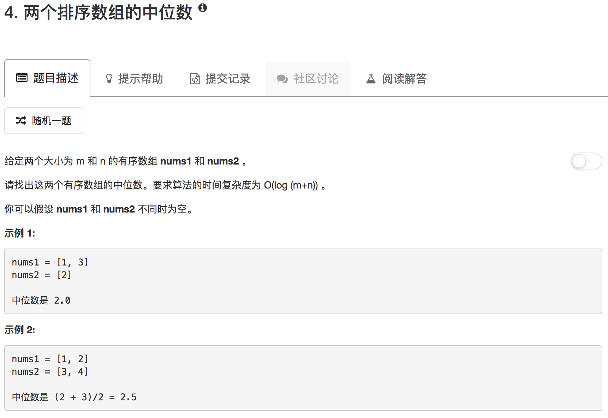

```python
class Solution(object):
    def findMedianSortedArrays(self, nums1, nums2):
        """
        :type nums1: List[int]
        :type nums2: List[int]
        :rtype: float
        """
        l1 = len(nums1)
        l2 = len(nums2)
        mid = (l1 + l2) // 2
        
        num1Idx = float("inf") if not nums1 else 0
        num2Idx = float("inf") if not nums2 else 0
        num3Idx = float("inf") if not nums1 else 0
        num4Idx = float("inf") if not nums2 else 0
        while mid>=0:
            n1 = float("inf") if num1Idx >len(nums1)-1 else nums1[num1Idx]
            n2 = float("inf") if num2Idx > len(nums2)-1 else nums2[num2Idx]
            n3 = float("-inf") if num3Idx >len(nums1)-1 else nums1[l1-1-num3Idx]
            n4 = float("-inf") if num4Idx > len(nums2)-1 else nums2[l2-1-num4Idx]
            if n1 < n2:
                num1Idx = num1Idx + 1
                small = n1
            else:
                num2Idx = num2Idx + 1
                small = n2
            
            if n3 > n4:
                num3Idx = num3Idx + 1
                large = n3
            else:
                num4Idx = num4Idx + 1
                large = n4
            mid = mid - 1

        return (small + large) / 2.0
```

