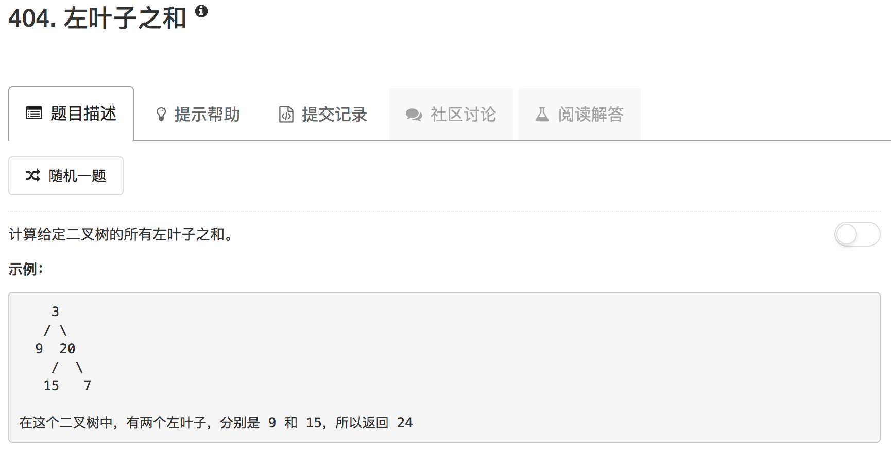

其实问题很简单，递归来做就行。给定某个节点，它的左叶子之和等于其左右子树的左叶子和的和。

```python
# Definition for a binary tree node.
# class TreeNode(object):
#     def __init__(self, x):
#         self.val = x
#         self.left = None
#         self.right = None

class Solution(object):
    def isLeaf(self, node):
        if not node: return False
        return not (node.left or node.right)
    
    def sumOfLeftLeaves(self, root):
        """
        :type root: TreeNode
        :rtype: int
        """
        if not root: return 0
        
        if not root.left: return self.sumOfLeftLeaves(root.right)
        
        if self.isLeaf(root.left): return root.left.val + self.sumOfLeftLeaves(root.right)
        
        return self.sumOfLeftLeaves(root.left) + self.sumOfLeftLeaves(root.right)
```

