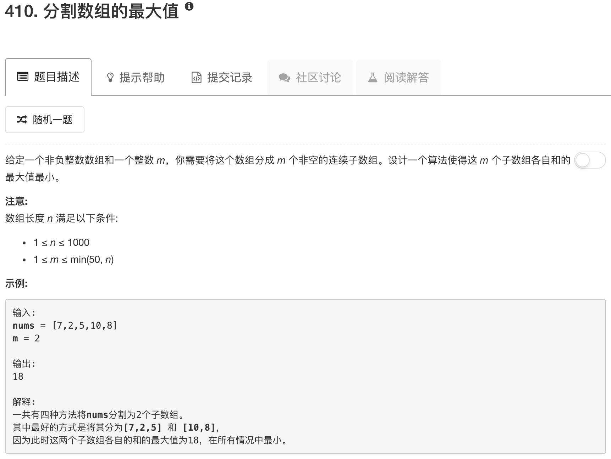

```python
class Solution:
    def splitArray(self, nums, m):
        """
        :type nums: List[int]
        :type m: int
        :rtype: int
        """
        prefix=[nums[0]]
        for i in range(1,len(nums)):
            prefix.append(nums[i]+prefix[-1])
        memo={}
        def helper(j,m):
            if len(nums)-j<m:
                return prefix[-1]
            if m==1:
                if j==0:
                    return prefix[-1]
                else:
                    return prefix[-1]-prefix[j-1]
            if len(nums)-j==m:
                return max(nums[j:])
            if (j,m) in memo:
                return memo[j,m]
            ans=prefix[-1]
            pre=0
            if j>0:
                pre=prefix[j-1]
            for j1 in range(1,len(nums)):
                tmp=prefix[j+j1-1]-pre
                if tmp>=ans:
                    break
                ans=min(ans,max(tmp,helper(j+j1,m-1)))
            memo[j,m]=ans
            return ans
        return helper(0,m)
```

这道题我完全不会。。。看了下网上有人说可以用动态规划求解

采用动态规划。用一个二维数组记录情况，记录分组里面子数组各自和的最大值最小的值。dp[i][j]表示将输入数组的前j个数分为i 组。其中有dp[0][0]=0。dp[i-1][k]表示将k个数分为i-1组，j-k个数单独分为一组。那么刚好合起来就是i组。 转变为找所有分组里面子数组和的最大值。在这些最大值里面找到最小的值。

```javascript
/**
 * @param {number[]} nums
 * @param {number} m
 * @return {number}
 */
var splitArray = function(nums, m) {
     //动态规划
    var len=nums.length;
    var dp=[];
    var maxArr=[0];
    nums.forEach(function(item,index){
        maxArr[index+1]=maxArr[index]+item;
    });
    for(var i=0;i<=m;i++)
    {
        dp[i]=[];
        for(var j=0;j<=len;j++)
        {
            dp[i][j]=maxArr[maxArr.length-1];
        }
    }
 
    dp[0][0]=0;
    for(var i=1;i<=m;i++)
    {
        for(var j=1;j<=len;j++)
        {
            for(var k=i-1;k<j;k++)
            {
                var value=Math.max(dp[i-1][k],maxArr[j]-maxArr[k]);
                dp[i][j]=Math.min(dp[i][j],value);
            }
        }
    }
 
    return dp[m][len];
 
};
```

