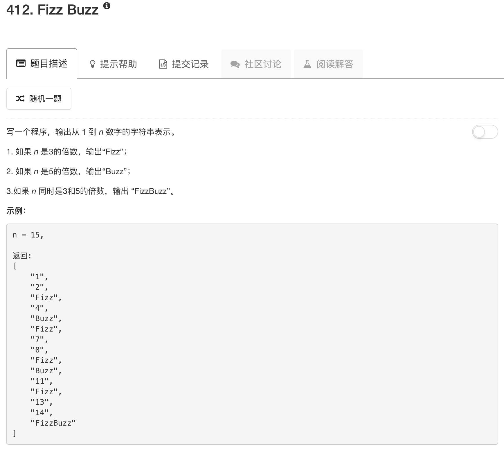

```python
class Solution:
    def fizzBuzz(self, n):
        """
        :type n: int
        :rtype: List[str]
        """
        ans = []
        for ii in range(1,n+1):
            a = ii % 3
            b = ii % 5
            if a == 0 and b == 0: 
                ans.append("FizzBuzz")
            elif a == 0 and b != 0:
                ans.append("Fizz")
            elif a != 0 and b == 0:
                ans.append("Buzz")
            else:
                ans.append(str(ii))
        return ans
```

