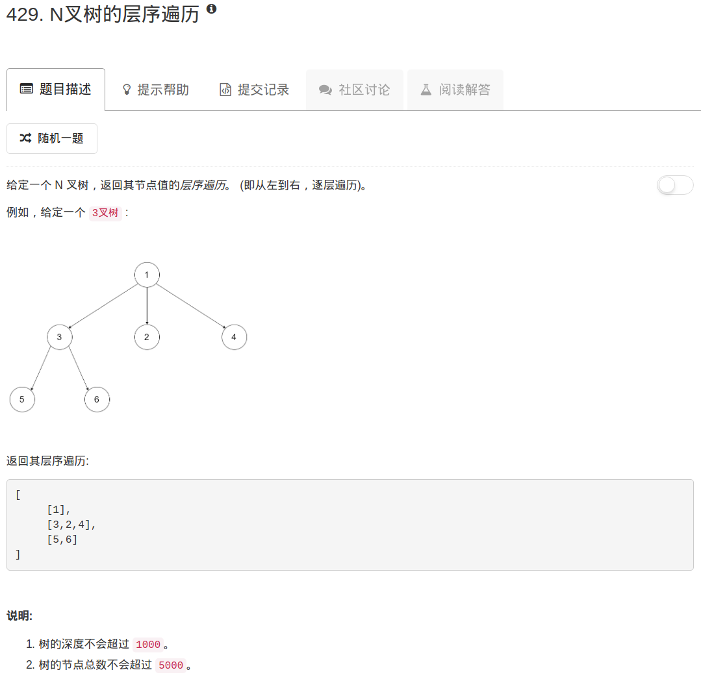

```python
"""
# Definition for a Node.
class Node(object):
    def __init__(self, val, children):
        self.val = val
        self.children = children
"""
class Solution(object):
    def levelOrder(self, root):
        """
        :type root: Node
        :rtype: List[List[int]]
        """
        if not root: return []
        queue = [root]
        ans = []
        
        while queue:
            nodes = []
            value = []
            for node in queue:
                nodes.extend([x for x in node.children])
                value.append(node.val)
            ans.append(value)
            queue = nodes
        return ans
```

