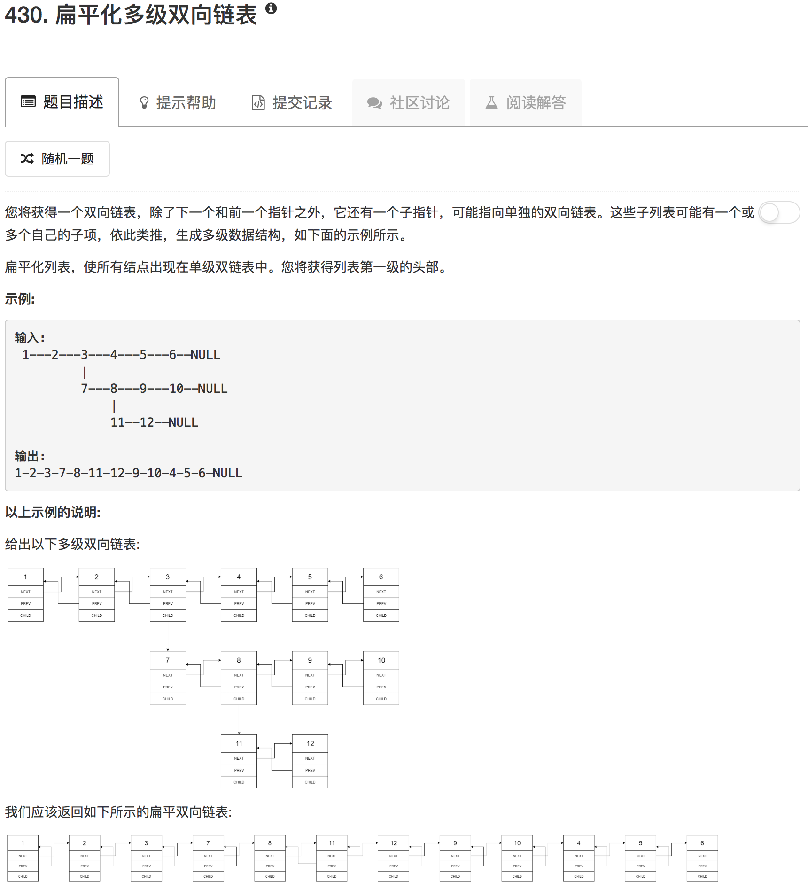

这道题有个取巧的方法。设现在的节点是head，head节点有child，可以先把child链表的末尾和head.next对接，然后再继续遍历每个节点。到最后，当节点为空时，全部的链表都没有child了

```python
"""
# Definition for a Node.
class Node(object):
    def __init__(self, val, prev, next, child):
        self.val = val
        self.prev = prev
        self.next = next
        self.child = child
"""
class Solution(object):
    def flatten(self, head):
        """
        :type head: Node
        :rtype: Node
        """
        if not head: return head
        chead = head
        while chead != None:
            if chead.child != None:
                tmp = chead.child
                while tmp.next != None:
                    tmp = tmp.next
                tmp.next = chead.next
                if chead.next != None: chead.next.prev = tmp
                chead.next = chead.child
                chead.child.prev = chead
                chead.child = None
            else:
                chead = chead.next
        return head
```

