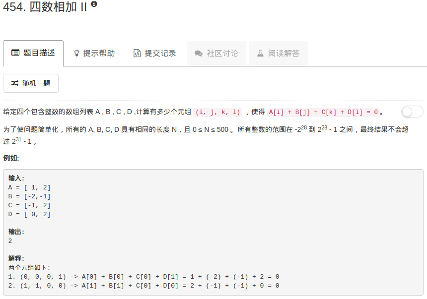

```python
class Solution:
    def fourSumCount(self, A, B, C, D):
        """
        :type A: List[int]
        :type B: List[int]
        :type C: List[int]
        :type D: List[int]
        :rtype: int
        """
        searchTable = dict()
        
        for ii in A:
            for jj in B:
                searchTable[ii+jj] = searchTable.get(ii+jj,0)+1
        
        ans = 0
        for ii in C:
            for jj in D:
                ans = ans + searchTable.get(-(ii+jj),0)
        
        return ans
```

这道题是真没想到能低于$O(n^2)$的解决方法。。。