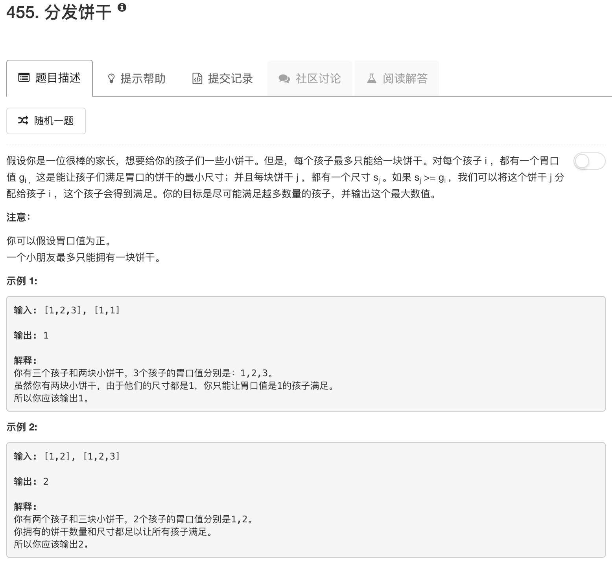

```python
class Solution:
    def findContentChildren(self, g, s):
        """
        :type g: List[int]
        :type s: List[int]
        :rtype: int
        """
        if not s: return 0
        
        g.sort()
        s.sort()
        
        ans = 0
        for ii in range(len(g)):
            for jj in range(len(s)):
                if g[ii] <= s[jj]: 
                    ans += 1
                    del s[jj]
                    break
        return ans
```

这么粗暴都能过。。。