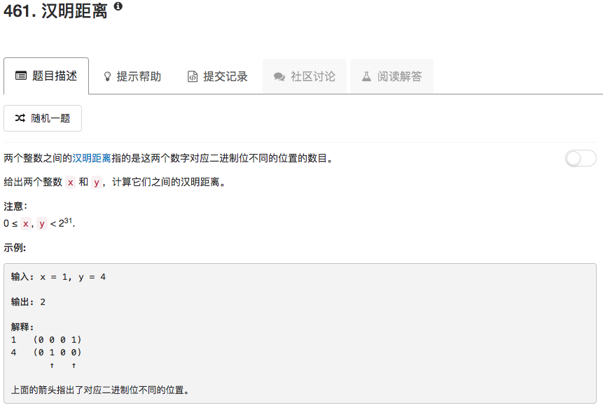

```python
class Solution(object):
    def hammingDistance(self, x, y):
        """
        :type x: int
        :type y: int
        :rtype: int
        """
        sum = 0
        while x or y:
            sum += (x & 1) ^ (y & 1)
            x = x >> 1
            y = y >> 1
        return sum
```

