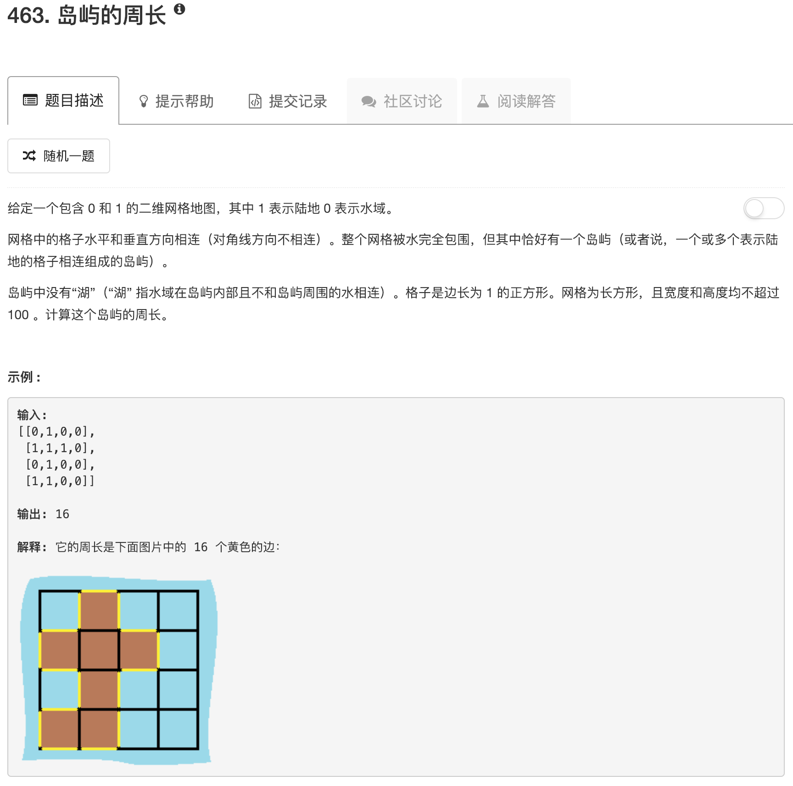

```python
class Solution:
    def islandPerimeter(self, grid):
        """
        :type grid: List[List[int]]
        :rtype: int
        """
        nrow = len(grid)
        ncol = len(grid[0])
        
        mark = [[0 for ii in range(ncol)] for jj in range(nrow)]
        
        for ii in range(nrow):
            for jj in range(ncol):
                if grid[ii][jj] == 1:
                    tmp = 1
                    if ii + 1 <= nrow-1 and grid[ii+1][jj] == 1: tmp += 1
                    if ii - 1 >= 0 and grid[ii-1][jj] == 1: tmp += 1
                    if jj + 1 <= ncol-1 and grid[ii][jj+1] == 1: tmp += 1
                    if jj - 1 >= 0 and grid[ii][jj-1] == 1: tmp += 1
                    mark[ii][jj] = tmp
        print(mark)
        ans = 0
        for ii in range(nrow):
            for jj in range(ncol):
                if mark[ii][jj] == 2: 
                    ans += 3
                elif mark[ii][jj] == 3:
                    ans += 2
                elif mark[ii][jj] == 1:
                    ans += 4
                elif mark[ii][jj] == 4:
                    ans += 1
        return ans
```

先遍历数组，当发现格点为1时，检查它的上下左右一共有多少个1。然后标记这个格点。最后按照不同的标记计算周长总和。