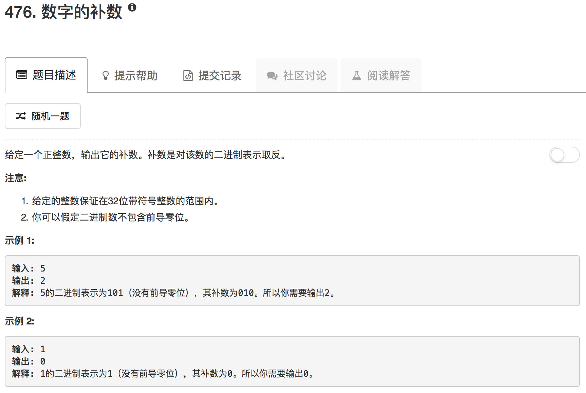

```python
class Solution(object):
    def findComplement(self, num):
        """
        :type num: int
        :rtype: int
        """
        comp = 0
        idx = 0
        while num:
            lastDigit = num & 1
            lastDigit = 1 - lastDigit
            lastDigit = lastDigit << idx
            idx = idx + 1
            num = num >> 1
            comp = comp + lastDigit
        return comp
```

